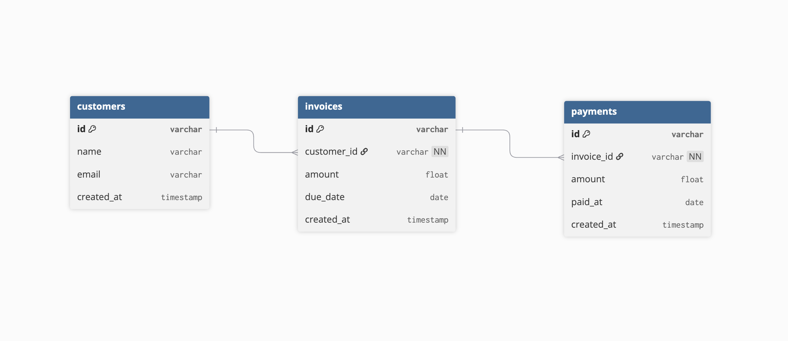

# Takaada Assignment

## Overview

This project simulates a simplified financial integration service similar to the systems built at Takaada.

The service integrates with a **simulated external accounting API**, stores financial data locally, and exposes APIs that provide insights about customer receivables and overdue invoices.

The goal of this exercise is to demonstrate:
- External system integration
- Financial data modelling
- API design
- Clean backend architecture
- Separation of responsibilities

---

## Tech Stack

- Python 3.10+
- Flask
- SQLAlchemy
- SQLite
- requests
---

## Quick Start

Run the mock API and main application in separate terminals.

Install dependencies:

```bash
pip install -r requirements.txt
```

Terminal 1 (Mock External API)

```bash
python mock_external_api.py
```

Terminal 2 (Main Application)

```bash
python run.py
```

Then open:

```
http://127.0.0.1:5000/sync
```

---


## Project Structure
```
app/
├── controllers/
│   └── insights_controller.py
├── services/
│   ├── sync_service.py
│   └── insight_service.py
├── models/
│   ├── customer.py
│   ├── invoice.py
│   └── payment.py
├── integrations/
│   └── accounting_client.py
├── database.py
└── __init__.py
run.py
mock_external_api.py
docs/
└── er-diagram.png
```
---

## Database Diagram

The diagram below shows the relationships between **Customers**, **Invoices**, and **Payments** in the local database.  
It helps visualize the data model and how different entities are connected.



## Components

**Models**

- Define the database schema
- Represent Customers, Invoices, and Payments

**Services**

- Handle business logic
- Data synchronization
- Financial insight calculations

**Controllers**
- Expose REST API endpoints

**Integrations**
- Simulated external accounting API

---

## Data Model

### Customer

| Field | Type |
| :--- | :--- |
| id | string |
| name | string |
| email | string |
| created_at | datetime |

### Invoice

| Field | Type |
| :--- | :--- |
| id | string |
| customer_id | foreign key |
| amount | float |
| due_date | date |
| created_at | datetime |

### Payment

| Field | Type |
| :--- | :--- |
| id | string |
| invoice_id | foreign key |
| amount | float |
| paid_at | date |
| created_at | datetime |

---

## System Flow

1. The system fetches data from a simulated **external accounting API** (mock server).  
2. Customer, invoice, and payment data are stored locally in SQLite.  
3. APIs expose financial insights such as:
   - Outstanding balance per customer
   - Overdue invoices


The architecture follows a controller → service → integration → database flow

### Flow Diagram
```
+---------------------+          +-------------------+          +-------------------+
| Mock External API   |  --->    | Local SQLite DB   |  --->    | Flask API Server  |
| (customers, invoices|          | Customers, Invoices|          | /sync, /balance,  |
| payments endpoints) |          | Payments tables   |          | /overdue endpoints|
+---------------------+          +-------------------+          +-------------------+
```
---

## Mock External API

The project includes a mock external accounting API to simulate real-world integration.

### Running the mock server
```bash
python mock_external_api.py
```
Server runs at:
```
http://127.0.0.1:5001
```

### Endpoints:
- `/customers` → returns list of customers
- `/invoices` → returns list of invoices
- `/payments` → returns list of payments

**Example response from `/customers`:**
```json
[
  {"id": "1", "name": "Acme Corp", "email": "finance@acme.com"},
  {"id": "2", "name": "Beta Industries", "email": "accounts@beta.com"}
]
```

The main app `/sync` endpoint pulls data from this mock server and stores it in the local database.

---

## Setup Instructions

### 1. Clone the repository
```bash
git clone https://github.com/00surya/takaada-integration-assignment.git
cd takaada-integration-assignment
```
### 2. Create a virtual environment
```bash
python -m venv venv
```

Activate it:

**Mac / Linux:**
```bash
source venv/bin/activate
```
**Windows:**
```bash
venv\Scripts\activate
```

### 3. Install dependencies
```bash
pip install -r requirements.txt
```

### 4. Start the mock external API

```bash
python mock_external_api.py
```

Runs at:
```
http://127.0.0.1:5001
```

### 5. Run the main app
```bash
python run.py
```

Server starts at:
```
http://127.0.0.1:5000
```
---

## API Endpoints

### 1. Sync External Data
Fetches customers, invoices, and payments from the simulated external API and stores them locally.

```http
GET /sync
```

**Example:**
```
http://127.0.0.1:5000/sync
```

**Response:**
```json
{
  "message": "Data synced"
}
```

### 2. Customer Outstanding Balance
Returns the total invoiced amount, total payments, and outstanding balance for a customer.

```http
GET /customers/<customer_id>/balance
```
**Example:**
```
http://127.0.0.1:5000/customers/1/balance
```

**Example response:**
```json
{
  "customer_id": 1,
  "total_invoiced": 15000,
  "total_paid": 0,
  "outstanding_balance": 15000
}
```
### 3. Overdue Invoices
Returns invoices that are past their due date and still unpaid. Supports pagination.

```http
GET /invoices/overdue?page=1&limit=20
```

**Example:**
```
http://127.0.0.1:5000/invoices/overdue?page=1&limit=10
```

**Example response:**
```json
[
  {
    "invoice_id": "101",
    "customer_id": "1",
    "amount_due": 10000,
    "due_date": "2026-03-01"
  }
]

```


---

## Key Design Decisions

**Service Layer**
Business logic is separated from controllers using a service layer. This keeps route handlers lightweight and improves maintainability.

**Local Data Storage**
External API data is stored locally to:
- avoid repeated API calls
- enable faster queries
- support financial insight calculations

**Idempotent Sync**
The sync process checks whether records already exist before inserting them. This ensures repeated sync calls do not create duplicate records.

**Pagination**
Pagination was added to the overdue invoices endpoint to avoid loading large datasets into memory.

---

## Assumptions

- External APIs provide stable IDs for customers, invoices, and payments.
- Invoices may have partial payments.
- An invoice is considered overdue when:
  `due_date < current_date` AND `total_payments < invoice_amount`

---

## Possible Improvements

Future improvements could include:
- Scheduled background sync jobs
- Authentication and authorization
- Customer risk scoring
- Invoice aging reports
- Database indexing for large datasets
- Docker containerization
- Automated tests

---

## Demo Flow

1. Start the mock external API:
   ```bash
   python mock_external_api.py
   ```
2. Start the main app:
   ```bash
   python run.py
   ```
3. Sync external data:
   ```http
   GET /sync
   ```
4. Query financial insights:
   ```http
   GET /customers/1/balance
   ```
   ```http
   GET /invoices/overdue
   ```

---

## Author

Surya Verma  
GitHub: https://github.com/00surya
